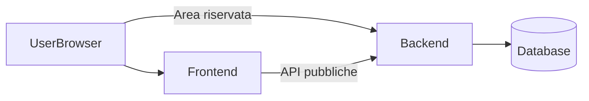

# Piano Backend FitLifeMilano

## Overview

Il backend FitLifeMilano espone **area riservata** (login, dashboard admin/coach/client) e **API** consumate dal frontend. L’**unica pagina pubblica** è il **login**; tutto il resto è protetto da autenticazione. Deploy su **Render** con dominio **https://fitlifemilano-backend.onrender.com**. Repository: **https://github.com/gioelecavallo13/FitLifeMilano-backend.git**.

---

## Modifiche rispetto al monolite

- **Rimozione rotte e pagine pubbliche:** nel backend non restano home, corsi, chi-siamo, contatti né il form contatti (POST `/contatti/store`); quelle funzionalità sono sul frontend.
- **Solo login pubblico:** l’unica parte accessibile senza auth è la pagina di login (`/area-riservata`) e il POST di login (`/login-process`). Tutto il resto è dietro middleware `auth` e ruoli.
- **Introduzione rotte API:** creazione di `routes/api.php` per health check e, in seguito, per API consumate dal frontend (es. elenco corsi pubblici).
- **CORS:** configurazione delle origini consentite per le chiamate API dal frontend (fitlifemilano-frontend.onrender.com, fitlifemilano.it).
- **Deploy su Render:** servizio web collegato al repo FitLifeMilano-backend, con URL **https://fitlifemilano-backend.onrender.com**.

---

## Architettura e domini



| Ruolo | URL / riferimento |
|-------|-------------------|
| **Backend** | https://fitlifemilano-backend.onrender.com — unica pagina pubblica = login (`/area-riservata`), resto protetto da auth. |
| **Frontend (per CORS)** | https://fitlifemilano-frontend.onrender.com (e opzionale https://fitlifemilano.it). |
| **Repository backend** | https://github.com/gioelecavallo13/FitLifeMilano-backend.git |

---

## Analisi del monolite (cosa toccare)

### Rotte da rimuovere in `routes/web.php`

- `GET /` (home)
- `GET /corsi`, `GET /chi-siamo`, `GET /contatti`
- `POST /contatti/store`
- L’import di `ContactRequestController` usato solo da `contact.store`

### Rotte da mantenere in `routes/web.php`

- **Blocco guest:** `GET /area-riservata` (nome rotta `login`), `POST /login-process` (`login.process`).
- **Blocco completo** `Route::middleware(['auth'])->group(...)`: logout, dashboard-selector, profilo e foto, gruppo admin (dashboard, corsi, messaggi, chat, coach, clienti, utenti), gruppo coach (dashboard, corsi, clienti, messaggi), gruppo client (dashboard, prenota-corsi, corsi, messaggi).

### Viste e controller

Le viste pubbliche (index, corsi, chi-siamo, contatti) e `ContactRequestController` non sono più usate dal backend (il form contatti è sul frontend). La loro rimozione è **opzionale** in una fase successiva per alleggerire il repo; **non è obbligatoria** per il primo deploy.

---

## Rotte web backend (dettaglio)

**File:** [routes/web.php](routes/web.php)

### Pubbliche (solo guest)

| Metodo | URI | Azione | Nome rotta |
|--------|-----|--------|------------|
| GET | `/area-riservata` | view `area-riservata` | `login` |
| POST | `/login-process` | `AuthController@login` | `login.process` |

### Protette (middleware `auth`)

- **Comuni:** `POST /logout` (`logout`), `GET /dashboard-selector` (`dashboard.selector`), `GET /profilo` (`profile.show`), `POST /profilo/foto` (`profile.updatePhoto`), `GET /utenti/{user}/foto` (`profile.photo`).
- **Admin** (prefix `admin`, middleware `role:admin`): dashboard, corsi (CRUD, unenroll), messaggi (index, show, reply), chat (index, show, send, markRead, startWithUser), inserisci-coach/store-coach, inserisci-clienti/store-clienti, utenti (index, show, edit, update, destroy).
- **Coach** (prefix `coach`, middleware `role:coach`): dashboard, corsi (index, show), clienti (show), messaggi (index, show, send, markRead, startWithClient, startWithCoachColleague).
- **Client** (prefix `client`, middleware `role:client`): dashboard, prenota-corsi (booking), corsi (show, enroll, cancel), messaggi (index, show, send, markRead, startWithCoach).

### Redirect root (opzionale)

Per evitare 404 sulla root del backend, si può definire `GET /` che reindirizza a `/area-riservata` (o all’URL del frontend).

---

## Rotte API backend

**File:** [routes/api.php](routes/api.php) — **da creare** (attualmente assente nella root del progetto).

### Registrazione

In [bootstrap/app.php](bootstrap/app.php) aggiungere nella `withRouting` la chiave:

```php
api: __DIR__.'/../routes/api.php',
```

### Contenuto iniziale

- **GET /api/health** — risposta JSON (es. `status`, `app`) per health check e test.
- In seguito: API pubbliche (es. elenco corsi per il sito pubblico) senza auth; API riservate con `auth:sanctum` (o sessione) se necessario.

Le rotte in `routes/api.php` sono sotto il prefisso `api` e lo stack API (JSON, throttling, ecc.).

---

## CORS

**File:** `config/cors.php` — se non esiste, pubblicare con `php artisan config:publish cors` (o equivalente Laravel 11) oppure configurare gli allowed origins nel middleware/bootstrap.

**Origini da consentire:**

- `https://fitlifemilano-frontend.onrender.com`
- `https://fitlifemilano.it`
- `http://127.0.0.1:8000` (sviluppo locale, se necessario)

**Metodi e header:** consentire GET, POST, PUT, PATCH, DELETE e gli header necessari alle chiamate API (Content-Type, Accept, Authorization se usato).

---

## Autenticazione e flusso "Area riservata"

- Il login è gestito **solo** nel backend (sessione web).
- **Flusso:** utente sul frontend clicca "Area Riservata" → redirect a `https://fitlifemilano-backend.onrender.com/area-riservata` → form login → POST a `/login-process` → redirect a dashboard (admin/coach/client). Non c’è login sul frontend.
- Il frontend deve avere **AREA_RISERVATA_URL** = `https://fitlifemilano-backend.onrender.com` (o `https://fitlifemilano-backend.onrender.com/area-riservata` se si preferisce il path esplicito).

---

## Configurazione ambiente (Render e .env.example)

### Variabili da impostare su Render

| Variabile | Valore / nota |
|-----------|----------------|
| APP_NAME | FitLifeMilano |
| APP_ENV | production |
| APP_DEBUG | false |
| APP_KEY | (generata con `php artisan key:generate`) |
| APP_URL | https://fitlifemilano-backend.onrender.com |
| DB_CONNECTION | pgsql o mysql a seconda del servizio Render |
| DB_HOST | (host del database) |
| DB_PORT | (porta) |
| DB_DATABASE | (nome database) |
| DB_USERNAME | (utente) |
| DB_PASSWORD | (password) |
| SESSION_DRIVER | file (o database/redis se multi-istanza) |
| CACHE_STORE | file (o redis se disponibile) |
| QUEUE_CONNECTION | database (o redis) |
| MAIL_* | (se invio email dal backend) |

Aggiornare [.env.example](.env.example) nel backend con `APP_URL=https://fitlifemilano-backend.onrender.com` e commenti per produzione.

---

## Repository GitHub e preparazione codice

**Progetto di partenza:** monolite attuale (root `FitLifeMilanoLaravel`).

- **Opzione A:** usare la root come codice del backend. Applicare le modifiche (rotte web, creazione api.php, bootstrap, CORS, .env.example). Poi `git init` (se nuovo) e `git remote add origin https://github.com/gioelecavallo13/FitLifeMilano-backend.git`, push su `main`.
- **Opzione B:** copiare il monolite in una cartella `FitLifeMilano-backend`, applicare le modifiche lì, inizializzare Git, aggiungere remote, push. La root resta il monolite.

Verificare che `.env` non venga pushato (è in `.gitignore`).

---

## Deploy su Render

- Creare un **Web Service** collegato al repository **FitLifeMilano-backend**.
- **Build command:** es. `composer install --no-dev --optimize-autoloader`.
- **Start command:** es. `php artisan migrate --force && php artisan config:cache && php artisan serve --port=$PORT` (adattare a Render; se usi Docker, usare lo script di entrypoint esistente).
- **Variabili d’ambiente:** impostare in dashboard Render tutte quelle della tabella (APP_URL, APP_KEY, DB_*, ecc.).
- **Dominio:** usare il default Render **https://fitlifemilano-backend.onrender.com** (eventualmente custom domain in seguito, es. app.fitlifemilano.it).

---

## Collegamento con il frontend

Nel frontend deployato su Render impostare la variabile **AREA_RISERVATA_URL**:

- `https://fitlifemilano-backend.onrender.com`  
  oppure  
- `https://fitlifemilano-backend.onrender.com/area-riservata`

**Verifica:** il clic su "Area Riservata" dal sito pubblico deve portare alla pagina di login del backend.

---

## Checklist pre-deploy backend

- [ ] **routes/web.php:** rimosse rotte pubbliche (/, corsi, chi-siamo, contatti, contact.store); mantenute solo guest (login) + auth.
- [ ] **routes/api.php:** creato e registrato in `bootstrap/app.php`.
- [ ] **CORS:** configurato per frontend (fitlifemilano-frontend.onrender.com, fitlifemilano.it).
- [ ] **.env.example:** aggiornato con APP_URL e note per produzione.
- [ ] **Codice:** pushato su GitHub (FitLifeMilano-backend).
- [ ] **Render:** servizio creato, build/start e variabili configurate.
- [ ] **Test:** GET `https://fitlifemilano-backend.onrender.com/area-riservata` mostra login; rotte protette richiedono login.
- [ ] **Frontend:** AREA_RISERVATA_URL punta a backend Render.

---

## Riepilogo e documentazione

| Aspetto | Scelta |
|---------|--------|
| Hosting | Render |
| Repo | FitLifeMilano-backend → https://github.com/gioelecavallo13/FitLifeMilano-backend.git |
| URL backend | https://fitlifemilano-backend.onrender.com |
| Unica pagina pubblica | Login (/area-riservata) |
| Frontend | AREA_RISERVATA_URL punta al backend Render |

**Documentazione:** aggiornare (nel repo backend o nel monolite) la documentazione con: architettura backend/frontend, flusso "Area riservata", elenco API, istruzioni per deploy su Render e dominio usato.
